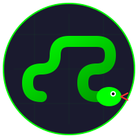

<p align="center">
  
</p>

<h1 align="center">XNAKE</h1>

<p align="center">
  <strong>Modern Snake Game with ML Anti-Cheat System</strong>
</p>

<p align="center">
  
  
  
  
</p>

<p align="center">
  <a href="https://github.com/SuperSonnix71/Xnake/issues">Report Bug</a>
  &middot;
  <a href="https://github.com/SuperSonnix71/Xnake">View Repository</a>
</p>

---

A modern browser-based Snake game with player registration, persistent scores, global leaderboards, and a comprehensive anti-cheat system powered by machine learning.

## Features

- Smooth animations with glowing effects
- Keyboard controls (Arrow Keys or WASD)
- Pause functionality (Space bar)
- Progressive speed increase
- Persistent player accounts and scores
- Hall of Fame leaderboard
- Hall of Shame for caught cheaters
- Dual-layer anti-cheat system (rule-based + neural network)

## Anti-Cheat System

XNAKE uses a hybrid anti-cheat system combining rule-based detection with a self-improving neural network.

### Rule-Based Detection

- Browser fingerprinting
- Session seed validation
- Full game replay verification
- Speed hack detection
- Pause abuse detection
- Bot pattern detection
- Rate limiting

### Neural Network Detection

A TensorFlow.js neural network analyzes 12 behavioral features to detect cheating patterns that rule-based systems might miss.

**Key Features:**
- Automatic training on first startup
- Shadow mode (logs suspicions without blocking)
- Periodic retraining on edge cases
- Model versioning with automatic rollback
- SHAP explainability for predictions

**How It Works:**
1. Server collects edge cases during normal operation (ML/rules disagreements)
2. Scheduler checks every 30 minutes for accumulated edge cases
3. When 10+ new edge cases accumulate, automatic retraining triggers
4. Training uses real data + edge cases + synthetic augmentation
5. New model activates only if it performs better than current model
6. Minimum 2-hour cooldown between retraining cycles

**Model Architecture:**
- Input: 12 normalized behavioral features
- Hidden Layer 1: 32 neurons (ReLU + dropout)
- Hidden Layer 2: 16 neurons (ReLU + dropout)
- Output: 1 neuron (sigmoid activation, 0-1 suspicion score)

## Quick Start

### Local Installation

```bash
git clone https://github.com/SuperSonnix71/Xnake.git
cd Xnake
npm install
npm start
```

Open `http://localhost:3333` in your browser.

### Docker Deployment

```bash
chmod +x deploy.sh
./deploy.sh
```

The game will be available at `http://localhost:3333`

### Development Mode

```bash
npm run dev
```

## API Endpoints

### Authentication
- `POST /api/register` - Register new player
- `POST /api/verify` - Verify session and auto-login
- `GET /api/session` - Check session status
- `POST /api/logout` - Logout player

### Game
- `POST /api/game/start` - Start new game session
- `POST /api/score` - Submit game score

### Leaderboards
- `GET /api/halloffame` - Top scores
- `GET /api/hallofshame` - Caught cheaters
- `GET /api/player/stats` - Player statistics
- `GET /api/stats` - Global statistics

### ML Anti-Cheat (Admin)
- `GET /api/ml/status` - Training status and edge cases
- `GET /api/ml/scheduler/status` - Scheduler status and configuration
- `GET /api/ml/versions` - All model versions with metrics
- `GET /api/ml/training-logs` - Training event history
- `GET /api/ml/edge-cases` - Edge case logs
- `POST /api/ml/train` - Manual retraining trigger

## Testing

```bash
node test/test-accuracy.js        # Model accuracy on synthetic data
node test/test-scheduler.js       # Scheduler configuration
node test/test-integration.js     # End-to-end integration tests
node test/test-server-startup.js  # Server startup with scheduler
```

## Controls

| Key | Action |
|-----|--------|
| Arrow Up / W | Move Up |
| Arrow Down / S | Move Down |
| Arrow Left / A | Move Left |
| Arrow Right / D | Move Right |
| Space | Pause/Unpause |

## Project Structure

```
snake/
├── public/             # Frontend files
│   ├── index.html      # Game interface
│   ├── game.js         # Game logic
│   ├── fingerprint.js  # Browser fingerprinting
│   └── style.css       # Styles
├── ml/                 # ML anti-cheat system
│   ├── features.js     # Feature extraction
│   ├── model.js        # Neural network
│   ├── train.js        # Training pipeline
│   ├── scheduler.js    # Periodic retraining scheduler
│   ├── worker.js       # Background training
│   ├── edgecases.js    # Edge case logging
│   ├── versioning.js   # Model versioning
│   └── shap.js         # Explainability
├── test/               # Test suite
│   ├── test-accuracy.js
│   ├── test-scheduler.js
│   ├── test-integration.js
│   └── test-server-startup.js
├── server.js           # Express server
├── database.js         # SQLite operations
└── xnake.db            # Database (auto-created)
```

## Technology Stack

**Backend:** Node.js, Express, sql.js, TensorFlow.js  
**Frontend:** HTML5 Canvas, Vanilla JavaScript, CSS3  
**Code Quality:** ESLint, TypeScript (type checking)

## Configuration

| Variable | Default | Description |
|----------|---------|-------------|
| `PORT` | 3333 | Server port |
| `SESSION_SECRET` | (hardcoded) | Session encryption key |

**Production:** Set secure `SESSION_SECRET`, enable HTTPS, use reverse proxy (nginx), backup `xnake.db` regularly.

## Author

Developed by Sonny Mir

## License

MIT License
